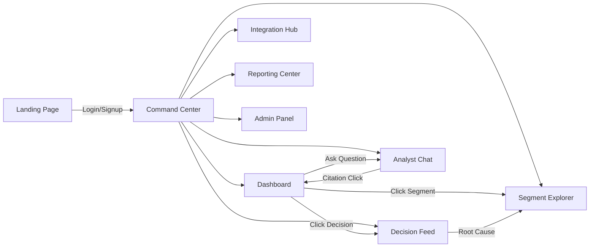

# AEGIS — Complete Product Design System

> **"The Operating System for Business Decision Intelligence"**

---

## I. PRODUCT ARCHITECTURE

### Platform Identity

AEGIS is **Decision Intelligence Infrastructure** — not a dashboard, not a BI tool, not an analytics platform. It is the cognitive layer between raw business data and executive action. Every pixel, interaction, and animation must reinforce this positioning.

**Category Claim:** "AEGIS doesn't show you charts. It tells you what to do."

### Information Hierarchy (Global)

```
┌─────────────────────────────────────────────────────────────┐
│  TIER 1 — LANDING (Acquisition)                            │
│  └─ Marketing site, product narrative, conversion          │
├─────────────────────────────────────────────────────────────┤
│  TIER 2 — COMMAND CENTER (Core Product)                    │
│  ├─ Executive Dashboard (default view)                     │
│  ├─ Decision Feed (anomaly timeline)                       │
│  ├─ Segment Explorer (drill-down)                          │
│  └─ Analyst Chat (conversational intelligence)             │
├─────────────────────────────────────────────────────────────┤
│  TIER 3 — OPERATIONS (Support Systems)                     │
│  ├─ Integration Hub (data sources)                         │
│  ├─ Reporting Center (exports, decks)                      │
│  └─ Admin & Governance (teams, roles, compliance)          │
└─────────────────────────────────────────────────────────────┘
```

### Navigation System



**Primary Nav:** Collapsed icon sidebar (left, 64px). Expands on hover to 240px with labels. Purple active indicator.

| Icon | Label | Route | Tier |
|------|-------|-------|------|
| ◈ | Dashboard | `/dashboard` | Core |
| ⚡ | Decision Feed | `/decisions` | Core |
| ◫ | Segments | `/segments` | Core |
| 💬 | Analyst | `/analyst` | Core |
| 🔗 | Integrations | `/integrations` | Ops |
| 📊 | Reports | `/reports` | Ops |
| ⚙ | Admin | `/admin` | Ops |

**Secondary Nav:** Contextual breadcrumbs + tab strips within each module.

### User Journeys

**Journey 1: Executive Morning Briefing (2 min)**
```
Login → Dashboard → Read Decision Header → Scan KPIs → 
Review top 3 Decision Cards → Read Intelligence Briefing → Done
```

**Journey 2: Anomaly Investigation (5 min)**
```
Dashboard → Notice red signal badge → Click to Focus Mode →
Read root cause → Navigate to Segment Explorer → Drill into affected segment →
Ask Analyst "Why did this happen?" → Review evidence citations → Export PDF
```

**Journey 3: First Data Upload (3 min)**
```
Login (new user) → Onboarding wizard → Upload CSV → 
Watch processing animation → View first insights → Guided tour of dashboard
```

**Journey 4: Monthly Board Report (10 min)**
```
Dashboard → Reporting Center → Select "Executive Monthly" template →
Configure date range → Preview → Add annotations → Export PDF/PPT
```

---

## II. DESIGN SYSTEM

### Color Palette

#### Core Surfaces
| Token | Hex | Usage |
|-------|-----|-------|
| `--bg-void` | `#020409` | Page background, deepest layer |
| `--bg-primary` | `#05070D` | Primary background |
| `--bg-surface` | `#0E111A` | Card backgrounds |
| `--bg-surface-hover` | `#1A1F2E` | Hover/focus states |
| `--bg-elevated` | `#1E2433` | Modals, dropdowns |
| `--border-subtle` | `#2A2F3A` | Card borders, dividers |
| `--border-active` | `#3A4150` | Active/hovered borders |

#### Text
| Token | Hex | Usage |
|-------|-----|-------|
| `--text-primary` | `#F8FAFC` | Headlines, values |
| `--text-secondary` | `#94A3B8` | Labels, descriptions |
| `--text-muted` | `#64748B` | Timestamps, metadata |
| `--text-disabled` | `#334155` | Disabled states |

#### Accent & Signal
| Token | Hex | Usage |
|-------|-----|-------|
| `--accent-primary` | `#A855F7` | AI actions, focus mode, citations |
| `--accent-glow` | `rgba(168,85,247,0.15)` | Focus glow, hover halos |
| `--signal-success` | `#10B981` | Positive trends, high confidence |
| `--signal-warning` | `#F59E0B` | Caution, medium confidence |
| `--signal-danger` | `#EF4444` | Critical alerts, low confidence |
| `--signal-info` | `#3B82F6` | Informational, neutral |
| `--signal-flat` | `#64748B` | No signal, stable |

#### Priority System
| Priority | Border | Badge BG | Text |
|----------|--------|----------|------|
| CRITICAL | `#EF4444` | `rgba(239,68,68,0.1)` | `#FCA5A5` |
| HIGH | `#F59E0B` | `rgba(245,158,11,0.1)` | `#FCD34D` |
| MEDIUM | `#3B82F6` | `rgba(59,130,246,0.1)` | `#93C5FD` |
| LOW | `#64748B` | `rgba(100,116,139,0.1)` | `#94A3B8` |

### Typography

**Font Stack:**
```css
--font-display: 'Inter', -apple-system, BlinkMacSystemFont, sans-serif;
--font-mono: 'JetBrains Mono', 'Fira Code', monospace;
```

| Role | Size | Weight | Font | Tracking |
|------|------|--------|------|----------|
| Page Title | 28px | 700 | Display | -0.02em |
| Section Header | 20px | 600 | Display | -0.01em |
| Card Title | 14px | 600 | Display | 0 |
| KPI Value | 32px | 500 | Mono | -0.02em |
| KPI Delta | 13px | 500 | Mono | 0 |
| Body | 14px | 400 | Display | 0 |
| Label | 11px | 600 | Display | 0.05em (uppercase) |
| Metadata | 10px | 400 | Mono | 0.02em |
| Code/Terminal | 13px | 400 | Mono | 0 |

### Spacing Scale

| Token | Value | Usage |
|-------|-------|-------|
| `--space-1` | 4px | Inline gaps, icon padding |
| `--space-2` | 8px | Tight component padding |
| `--space-3` | 12px | Card internal padding |
| `--space-4` | 16px | Standard gaps, section padding |
| `--space-6` | 24px | Major section gaps |
| `--space-8` | 32px | Page-level separation |
| `--space-12` | 48px | Landing page sections |

### Border Radius
| Token | Value | Usage |
|-------|-------|-------|
| `--radius-sm` | 2px | Buttons, inputs |
| `--radius-md` | 4px | Cards, panels |
| `--radius-lg` | 8px | Modals, landing cards |
| `--radius-full` | 9999px | Pills, badges |

### Motion System

#### Transitions
```css
--ease-default: cubic-bezier(0.4, 0, 0.2, 1);     /* 200ms */
--ease-spring:  cubic-bezier(0.34, 1.56, 0.64, 1); /* 300ms */
--ease-smooth:  cubic-bezier(0.16, 1, 0.3, 1);     /* 400ms */
```

#### Animation Catalogue

| Animation | Duration | Trigger | Easing |
|-----------|----------|---------|--------|
| Card entrance | 400ms | Mount + stagger 60ms | ease-smooth |
| Focus dim | 200ms | Focus mode toggle | ease-default |
| Focus glow pulse | 2000ms | Focus active (loop) | ease-in-out |
| KPI counter | 800ms | Data load | ease-smooth |
| Chart draw | 600ms | Data load | ease-smooth |
| Typewriter | 30ms/char | Intelligence briefing | linear |
| Sidebar expand | 200ms | Hover | ease-default |
| Signal pulse | 1500ms | New anomaly (loop) | ease-in-out |
| Confidence fill | 600ms | Score update | ease-spring |
| Skeleton shimmer | 1500ms | Loading (loop) | linear |
| Page transition | 300ms | Route change | ease-smooth |
| Toast slide | 200ms | Notification | ease-spring |

#### Loading States
- **Skeleton:** Dark shimmer (`#0E111A` → `#1A1F2E` → `#0E111A`)
- **Scanner:** Radar sweep line rotating 360° over wireframe layout
- **Progress:** Segmented bar filling left-to-right with purple accent

### Elevation System

| Level | Shadow | Usage |
|-------|--------|-------|
| 0 | none | Flat cards |
| 1 | `0 1px 3px rgba(0,0,0,0.3)` | Raised cards |
| 2 | `0 4px 12px rgba(0,0,0,0.4)` | Dropdowns, popovers |
| 3 | `0 8px 24px rgba(0,0,0,0.5)` | Modals |
| Focus | `0 0 15px var(--accent-glow)` | Focus mode spotlight |

### Data Visualization Standards

#### Chart Palette (ordered)
```
#F8FAFC (primary line)
#A855F7 (accent/highlight)
#10B981 (positive)
#F59E0B (warning)
#EF4444 (danger)
#3B82F6 (info)
#8B5CF6 (secondary purple)
#EC4899 (pink, segments)
```

#### Chart Rules
1. **Background:** Always `transparent` on `--bg-surface`
2. **Grid lines:** `#1A1F2E`, 1px, dashed
3. **Axis labels:** `--text-muted`, 10px mono
4. **Active dot:** 6px, filled, with 8px glow ring
5. **Tooltip:** `--bg-elevated` with `--border-active`, no arrow
6. **Crosshair:** `#A855F7`, 1px solid, synced via `syncId`
7. **Area fill:** 5% opacity of line color, gradient to transparent
8. **No 3D.** No pie charts. No donut charts in core views.

---

## III. COMPONENT LIBRARY STRUCTURE

### Hierarchy

```
@aegis/ui (shared primitives)
├── Button (primary, secondary, ghost, danger)
├── Badge (status, priority, signal)
├── Card (base, kpi, decision, insight)
├── Input (text, search, select, date-range)
├── Table (sortable, virtualized, expandable)
├── Tabs (flat, underline)
├── Modal (standard, confirmation, full-screen)
├── Toast (info, success, warning, error)
├── Tooltip (standard, rich)
├── Skeleton (line, card, chart)
├── SegmentedControl (time range, view mode)
├── VisualConfidence (10-block meter)
├── SignalBadge (direction + type)
├── PriorityIndicator (border + badge)
└── Avatar (user, team)

@aegis/charts
├── TrendLine (single metric over time)
├── ComparisonChart (multi-metric overlay)
├── SegmentTreemap (hierarchical segment view)
├── HeatmapGrid (signal severity matrix)
├── SparkLine (inline mini chart)
├── BarComparison (segment vs segment)
└── FunnelChart (conversion stages)

@aegis/intelligence
├── NarrationTerminal (typewriter briefing)
├── ChatInterface (conversational AI)
├── ChatCitation (UI-linked reference)
├── DecisionCard (actionable recommendation)
├── RootCausePanel (causal chain visualization)
└── EvidenceChip (supporting data point)

@aegis/layout
├── AppShell (sidebar + main + header)
├── PageHeader (title + breadcrumbs + actions)
├── BentoGrid (responsive card grid)
├── SplitPane (resizable dual-panel)
├── CollapsibleSidebar (icon ↔ full)
└── FocusModeOverlay (global dimming mask)
```

### Card Hierarchy

| Card Type | Border | Height | Content Density | Interactive |
|-----------|--------|--------|-----------------|-------------|
| KPI Card | subtle | 120px | Low (value + delta) | Click → Focus |
| Decision Card | priority-colored | 160px | Medium (headline + confidence + action) | Click → Expand |
| Insight Card | subtle | 140px | Medium (narrative + evidence) | Click → Detail |
| Signal Card | signal-colored | 100px | Low (direction + magnitude) | Click → Focus |
| Segment Card | subtle | 200px | High (metrics + sparkline) | Click → Drill |
| Integration Card | subtle | 180px | Medium (status + config) | Click → Setup |

---

## IV. CONCEPT MOCKUPS

### Dashboard Command Center


### Landing Page


### Decision Feed


### Segment Explorer


