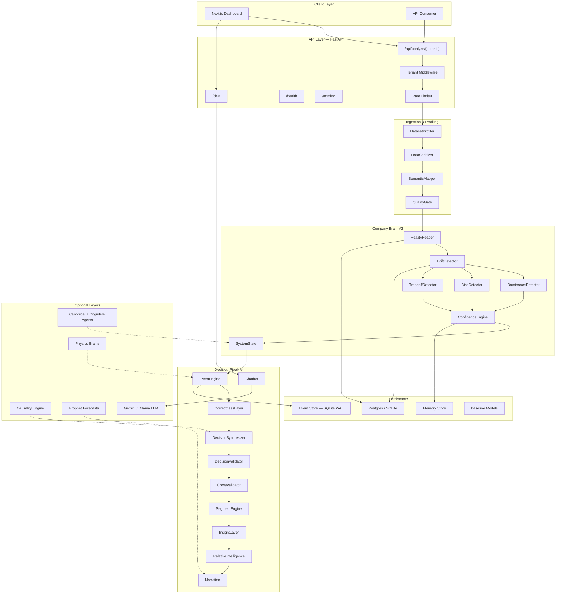

<p align="center">
  
</p>

<h1 align="center">AEGIS — Autonomous Enterprise General Intelligence System</h1>

<p align="center">
  <em>A deterministic, multi-tenant decision intelligence engine that transforms raw business data into ranked, auditable decisions — without machine learning in the critical path.</em>
</p>

<p align="center">
  
  
  
  
  
</p>

---

## What is AEGIS?

AEGIS is **not** an LLM, not an ML platform, and not a BI dashboard. It is a **rule-driven epistemic engine** — a system that ingests tabular business data (CSV) and emits ranked, confidence-scored business decisions through a deterministic chain of statistical detectors, a layered confidence engine, and a fail-open synthesis pipeline.

### Three Core Contracts

| Contract | Description |
|----------|-------------|
| **MIU Gate** | The system **refuses to speak** below ~1,000 rows. Below that threshold, the system state is `OBSERVATION` — it is still learning. |
| **Calibrated Silence** | If no signal clears the confidence threshold, the system returns `SILENT` rather than fabricate insight. Silence is a valid, intentional output. |
| **Determinism** | Same CSV in → same JSON out. Sorted keys at every stage, no randomness in the core decision path, no model temperature. |

### Why Not Just Use an LLM?

| Concern | LLM Approach | AEGIS Approach |
|---------|-------------|----------------|
| **Auditability** | Black box — can't trace a sentence to a data row | Every decision carries full evidence chain back to source rows |
| **Hallucination** | Models fabricate plausible-sounding insights | Deterministic detectors — no generation, only detection |
| **Reproducibility** | Same prompt → different output | Same CSV → identical JSON, every time |
| **Silence** | LLMs always produce output | AEGIS stays silent when it doesn't have sufficient evidence |
| **Cost** | Token costs scale with data volume | Statistical computation — no per-token cost |

---

## Architecture

### High-Level Pipeline

```
CSV Upload
 │
 ├── DatasetProfiler        → Column typing, role hints, temporal detection
 ├── DataSanitizer           → Currency/percentage/NaN normalization
 ├── SemanticMapper          → Column names → canonical schema (200+ synonyms)
 ├── RealityReader           → Per-column statistical fingerprint (μ, σ, CV, outliers)
 ├── QualityGate             → Row-level admissibility, data quality score
 ├── BaselinePersistence     → Postgres/SQLite snapshot for drift comparison
 └── DriftDetector           → σ-band comparison vs last baseline
         │
         ▼
 ┌─────────────────────────────────────────────────┐
 │            COMPANY BRAIN V2                     │
 │                                                 │
 │  ┌─────────────────┐  ┌──────────────┐         │
 │  │ DominanceDetector│  │ BiasDetector │         │
 │  │ (concentration)  │  │ (√N CUSUM)   │         │
 │  └────────┬────────┘  └──────┬───────┘         │
 │           │                  │                  │
 │  ┌────────┴──────────────────┴───────┐         │
 │  │        TradeoffDetector           │         │
 │  │  (Pearson + economic polarity)    │         │
 │  └───────────────┬───────────────────┘         │
 │                  │                              │
 │  ┌───────────────┴───────────────────┐         │
 │  │      ConfidenceEngine             │         │
 │  │  (5-factor weighted scoring)      │         │
 │  └───────────────┬───────────────────┘         │
 │                  │                              │
 │  ┌───────────────┴───────────────────┐         │
 │  │        SystemState                │         │
 │  │  OBSERVATION │ SILENT │ INSIGHTFUL│         │
 │  └───────────────────────────────────┘         │
 └─────────────────────┬───────────────────────────┘
                       │
                       ▼
 ┌─────────────────────────────────────────────────┐
 │         DECISION PIPELINE                       │
 │                                                 │
 │  EventEngine → CorrectnessLayer                 │
 │  → DecisionSynthesizer → DecisionValidator      │
 │  → CrossValidator → SegmentEngine               │
 │  → InsightLayer → RelativeIntelligence          │
 │  → DecisionCompressor (top-5 ranked)            │
 │  → Narration + Chatbot                          │
 └─────────────────────┬───────────────────────────┘
                       │
                       ▼
              Structured JSON Response
          (decisions, evidence, lineage)
```

### System Architecture Diagram



---

## Repository Structure

```
aegis_ai/
├── api/                    # FastAPI entrypoint (routes.py, main.py)
├── sanitizer/              # DataSanitizer, SemanticMapper, ColumnFilter, QualityGate
├── brains/                 # RealityReader, DriftDetector, baseline learners
├── company_brain/          # V2 orchestrator + 3 detectors + ConfidenceEngine + Synthesizer
├── core/                   # EventEngine, CorrectnessLayer, DecisionPipeline, Validator,
│                           # CrossValidator, SegmentEngine, InsightLayer, Narration, Chatbot
├── causality/              # TimeCausalGraph (lagged correlation), TransferEntropy, PC algorithm
├── spine/                  # EventStore (SQLite WAL), Normalizer, IngestionRouter, LineageAudit
├── agents/                 # Canonical (regime, heartbeat, escalation) + Cognitive (planner, root-cause)
├── patterns/               # IsolationForest, TCN, ContextTCN, Consensus
├── physics/                # Domain physics brains (sales, ops, HR, finance, logistics)
├── memory/                 # PgMemory, SemanticMemoryStore, ShadowBaseline, RegimeStabilityBuffer
├── persistence/            # SnapshotRepository, CognitiveSnapshotRepository
├── security/               # API key management, tenant middleware, rate limiting, quota registry
├── quarantine/             # DriftGuard, SchemaContracts, PromotionRouter
├── db/                     # SQLAlchemy session + baseline persistence
├── llm/                    # Gemini provider (cloud) + Ollama provider (local, optional)
├── connectors/             # CSV, accounting, sales, HR, logistics adapters
├── domains/                # Finance + manufacturing domain adapter rules
├── motor/                  # Self-healing executor (action retry within policy bounds)
├── services/               # CausalEngine, DecisionExplainer, PersistenceService
└── _experimental_stability/# Homeostasis, immune system, guardrails, self-repair

aegis-ui/                   # Next.js 16 dashboard frontend
├── src/app/                # Pages: dashboard, decisions, segments, analyst, admin, reports
├── src/components/         # Charts, KPI cards, decision cards, upload workflow, chat interface
├── src/store/              # Zustand state management
├── src/services/           # API client, data transformer
└── src/hooks/              # useAnalysis, useChat
```

---

## Detection Engines

### 1. Dominance Detector
Detects **structural concentration** — a single value, category, or narrow range dominating a metric.

| Subtype | Logic | Threshold |
|---------|-------|-----------|
| **Categorical** | Single category ≥ 60% of rows | `p_max ≥ 0.60` |
| **Point** | Single repeated numeric value ≥ 60% | Rounded to 3 decimals |
| **Range (STD)** | ≥ 70% of values within `[μ ± 0.5σ]` | `coverage ≥ 0.70` |
| **Range (Quantile)** | ≥ 70% of values within `[Q25, Q75]` | Fallback method |

### 2. Bias Detector (√N-Scaled CUSUM)
Detects **persistent directional drift** using a cumulative sum test with √N-scaling to prevent false positives on long series.

```
h = min(3 · √(N/50), 12) · σ       ← adaptive threshold
Signal fires when max_cusum > h
```

### 3. Tradeoff Detector
Detects **economic tradeoffs** between metric pairs using Pearson correlation with an economic polarity filter.

| Polarity A | Polarity B | Correlation | Classification |
|------------|------------|-------------|----------------|
| Same | Same | Negative | **CONFLICT** ✓ |
| Opposite | Opposite | Positive | **TRUE_TRADEOFF** ✓ |
| Same | Same | Positive | Co-movement (suppressed) |
| Any NEUTRAL | Any | Any | **UNKNOWN** ✓ |

### Confidence Engine (5-Factor Universal Score)

```
confidence = 0.25 · N_score + 0.30 · signal_score + 0.20 · persistence
           + 0.15 · consistency - 0.10 · penalty
```

| Factor | Weight | Description |
|--------|--------|-------------|
| Sample size (N) | 0.25 | Logarithmic ramp from 1K to 10K rows |
| Signal strength | 0.30 | Detector-reported signal score |
| Temporal persistence | 0.20 | Exponential decay across uploads (T½ = 90 days) |
| Cross-segment consistency | 0.15 | Volume-weighted segment variance |
| Penalty | 0.10 | Deductions for data quality, immaturity |

---

## Decision Types

| Decision | Trigger | Priority |
|----------|---------|----------|
| `REGIME_SHIFT` | BIAS signal with relative delta > 0.5 | CRITICAL |
| `EFFICIENCY_GAIN` | OUTPUT↑ + INPUT↓ | HIGH |
| `DEMAND_DECLINE` | OUTPUT↓ corroborated by VALUE↓ | HIGH |
| `QUALITY_DETERIORATION` | QUALITY metric↑ (defects, churn) | HIGH |
| `FUNNEL_BREAKDOWN` | INPUT↑ + OUTPUT↓ | HIGH |
| `CONCENTRATION_RISK` | Any STRUCTURAL/dominance event | HIGH |
| `PRICING_SHIFT` | COST drift ± OUTPUT countermovement | MEDIUM |
| `GROWTH_SIGNAL` | OUTPUT↑ + VALUE↑ | MEDIUM |
| `TRADEOFF` | TRUE_TRADEOFF or CONFLICT pair | MEDIUM |
| `INVENTORY_SHIFT` | TRANSFER direction drift | MEDIUM |

---

## Use Cases

### 1. Revenue & Sales Intelligence
Upload transactional sales data → AEGIS detects revenue drift, channel concentration, pricing shifts, and funnel breakdowns. Segment analysis reveals which regions or product lines are driving or dragging performance.

### 2. Marketing Campaign Optimization
Feed campaign performance CSVs → detect tradeoffs between spend and conversions, identify which channels show diminishing returns, flag campaigns where cost is rising but ROI is declining.

### 3. Supply Chain & Logistics Monitoring
Upload warehouse or logistics data → detect inventory concentration risks, identify demand decline signals across regions, flag quality deterioration in fulfillment metrics.

### 4. Financial Health Assessment
Ingest accounting exports → physics-layer enforces balance sheet identities (`Revenue - Cost - Tax ≈ Profit`), detects structural cost shifts, flags regime changes in financial metrics.

### 5. HR & Workforce Analytics
Upload employee or HR data → detect attrition concentration, identify workforce bias patterns, flag quality signals in retention or engagement metrics.

### 6. Manufacturing & Operations
Feed production data → detect operational concentration risks, identify efficiency gains or degradation, monitor quality metrics against historical baselines.

---

## API Reference

### Core Endpoints

| Method | Endpoint | Description |
|--------|----------|-------------|
| `POST` | `/api/analyze/{domain}` | Upload CSV, receive full structured analysis |
| `POST` | `/chat` | Ask natural-language questions grounded in analysis |
| `GET` | `/health` | Liveness probe |
| `GET` | `/ready` | Readiness probe (DB connectivity check) |
| `GET` | `/health/llm` | LLM provider health status |
| `POST` | `/health/llm/warmup` | Force-load LLM into memory |
| `GET` | `/monitor/{domain}` | Monitoring timeline for a domain |
| `POST` | `/ingest/{port}` | JSON webhook ingestion (sales, ops, finance, HR, logistics) |
| `*` | `/admin/*` | Tenant & API key management (protected) |

### Analyze Request

```bash
curl -X POST "http://localhost:8000/api/analyze/sales" \
  -H "X-API-Key: your-api-key" \
  -F "file=@sales_data.csv"
```

### Response Shape

```jsonc
{
  "status": "LIVE",
  "system_state": "INSIGHTFUL",           // OBSERVATION | SILENT | INSIGHTFUL
  "narrative": "AEGIS detected 3 structural patterns...",

  "final_decisions": [                     // Compressed top-5, ranked
    {
      "type": "EFFICIENCY_GAIN",
      "title": "Revenue increased while Ad Spend decreased",
      "priority": "HIGH",
      "confidence": 0.78,
      "impact": 0.62,
      "signals": ["Revenue", "Ad_Spend"],
      "fact": "...",
      "confidence_explanation": "...",
      "business_implication": "..."
    }
  ],

  "global_decisions": [...],              // Full decision detail
  "segment_decisions": {...},             // Per-dimension breakdowns
  "aegis_insights": [...],               // RISK / TRADEOFF / LEAKAGE / OPPORTUNITY
  "relative_decisions": [...],            // Segment vs global comparisons
  "drift_report": {...},                  // Per-metric drift status
  "quality_report": {...},                // Data quality scores
  "analysis": {...},                      // Full structured output
  "narration": "..."                      // Natural language summary
}
```

---

## Multi-Tenancy & Security

- **API Key Authentication** — every request requires `X-API-Key` header, resolved to `tenant_id`
- **Tenant Isolation** — all persistence (baselines, semantic mappings, events, decisions) is keyed by `(tenant_id, domain)`
- **Rate Limiting** — per-key quotas via in-memory + optional Redis rate gate
- **Upload Guard** — rejects payloads > 500 MB
- **Input Validation** — minimum 10 rows, minimum 2 columns, duplicate column rejection
- **Secure Error Handling** — global exception handler never leaks stack traces to clients

---

## Data Stores

| Store | Engine | Purpose |
|-------|--------|---------|
| `aegis.db` | Postgres / SQLite | Tenants, semantic mappings, reality baselines, drift events |
| `aegis_events.db` | SQLite (WAL mode) | High-frequency event log, monitoring windows, regime classification |
| `aegis_memory.db` | SQLite | Cognitive snapshots, insight ledger |
| `baseline_models/` | Pickle / Parquet | Prophet, IsolationForest, TCN model artifacts |
| `tenant_universes/` | JSON | Per-tenant role registries and domain extensions |

---

## Getting Started

### Prerequisites

- **Python 3.11+**
- **Node.js 18+** (for the dashboard)
- **PostgreSQL** (recommended) or SQLite (default for development)

### Backend Setup

```bash
# Clone the repository
git clone https://github.com/Chinmayjoshi10/aegis-ai.git
cd aegis-ai

# Create virtual environment
python -m venv venv
venv\Scripts\activate          # Windows
# source venv/bin/activate    # macOS/Linux

# Install dependencies
pip install -r requirements.txt
pip install -e .

# Configure environment
cp .env.example .env
# Edit .env with your GEMINI_API_KEY and database settings

# Start the API server
uvicorn aegis_ai.api.main:app --host 0.0.0.0 --port 8000 --reload
```

### Frontend Setup

```bash
cd aegis-ui

# Install dependencies
npm install

# Configure API endpoint
echo "NEXT_PUBLIC_API_URL=http://localhost:8000" > .env.local

# Start development server
npm run dev
```

The dashboard will be available at `http://localhost:3000`.

### Quick Test

```bash
# Health check
curl http://localhost:8000/health

# Analyze a CSV
curl -X POST "http://localhost:8000/api/analyze/sales" \
  -H "X-API-Key: test-key" \
  -F "file=@your_data.csv"
```

---

## Tech Stack

### Backend
| Technology | Purpose |
|-----------|---------|
| **FastAPI** | Async API framework with OpenAPI docs |
| **Pandas / NumPy / SciPy** | Statistical computation engine |
| **SQLAlchemy + Alembic** | ORM and database migrations |
| **Pydantic** | Request/response validation |
| **Google Gemini SDK** | Optional LLM for narration and semantic mapping |
| **Uvicorn** | ASGI server |

### Frontend
| Technology | Purpose |
|-----------|---------|
| **Next.js 16** | React framework with App Router |
| **React 19** | UI component library |
| **Zustand** | Lightweight state management |
| **Recharts** | Data visualization charts |
| **TanStack Table** | Data table management |
| **Tailwind CSS 4** | Utility-first styling |
| **Lucide React** | Icon system |

---

## Design Philosophy

### Fail-Open Architecture
Every detector, every pipeline stage is wrapped in `try/except` that logs and continues. A crash in one detector can never kill the request — the stage is skipped, a warning is logged, and the pipeline continues with a degraded but valid response.

### No Black Box
The only stochastic components (Prophet, TCN, XGBoost/SHAP) are **advisory and fail-open**. The core decision path is a pure function of the input CSV plus stored baselines. An LLM is used only for optional narration enhancement — never in the decision-making path.

### Auditable Decisions
Every decision carries:
- The evidence block from the originating detector
- The confidence inputs and their individual weights
- Lineage IDs back to the raw event
- Segment attribution (which dimension drove the signal)

A regulator or CFO can trace any sentence in the narrative back to the rows that produced it.

---

## Safety Guarantees

| Guarantee | Implementation |
|-----------|---------------|
| **Deterministic output** | Sorted keys at every stage, seeded subsampling, no randomness |
| **Two-layer ID filtering** | Column filter + event engine + correctness layer all reject identifiers |
| **JSON safety** | Every response passes through `_sanitize_for_json()` to remove NaN/Inf |
| **Baseline maturity gating** | Immature baselines (< 2 uploads) get 0.8x confidence penalty |
| **Direction validation** | 30/70 split correctness layer verifies every signal against actual data |
| **Subsample stability** | Decisions validated across 3 bootstrap samples; rejected if < 67% consistent |
| **Regime hysteresis** | Regime changes require 2 consecutive matching candidates to confirm |

---

## System States

```
                    ┌─────────────┐
                    │ OBSERVATION │  ← Fewer than 1,000 rows
                    └──────┬──────┘
                           │ ≥ 1,000 rows
                    ┌──────▼──────┐
                    │   SILENT    │  ← No signal clears confidence threshold
                    └──────┬──────┘
                           │ Signal ≥ 0.50 confidence
                    ┌──────▼──────┐
                    │ INSIGHTFUL  │  ← Decisions emitted
                    └─────────────┘
```

---

## Contributing

This is a proprietary system. For internal contributors:

1. All changes must maintain the **fail-open** contract
2. No ML in the core decision path — statistical detectors only
3. Every new detector must emit the canonical event schema
4. New decision types must be registered in both `DecisionSynthesizer` and the compression `_TYPE_RANK`
5. All confidence adjustments must route through `ConfidenceEngine` (not ad-hoc multipliers)

---

<p align="center">
  <sub>Built with precision. Designed for trust.</sub>
</p>
